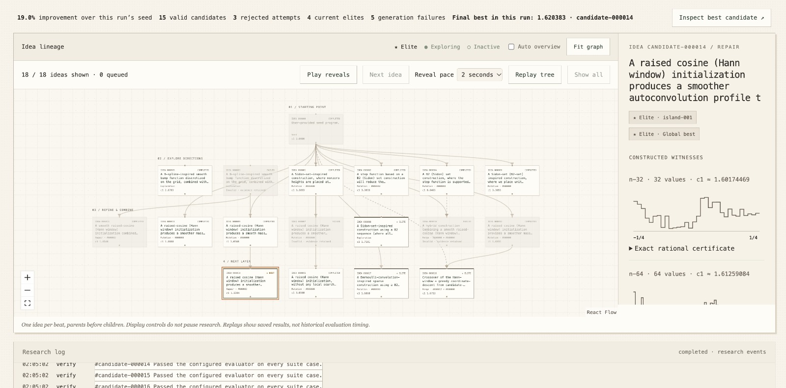
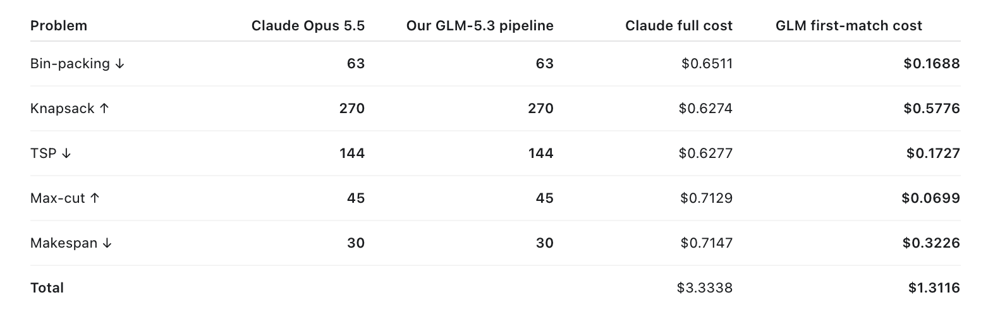

# Project BirdNest

An autoresearch framework that uses an evolutionary algorithm to search for algorithms that solve any Lean-modelled problem. You describe a problem in plain language and give it instances. The system
turns the statement into a checked Lean specification, compiles that into a frozen
scorer, and then uses an LLM to propose Python candidates. Each candidate runs in an
isolated Docker worker and gets an exact score. Every idea, its parents and its score
are recorded in a lineage graph, so you can see how the search got where it did.

## How it works

1. **Problem.** A natural-language statement and a set of instances. The problem must be
   Lean-modelled, which steps 2 and 3 produce and check. 
2. **Formalize.** A fine-tuned Qwen3-4B model drafts a Lean statement of the problem.
   Compiler errors are fed back for repair.
3. **Check.** Lean 4.19 with Mathlib compiles the statement, using a pinned checker on Modal.
   A fine-tuned Qwen classifier, also on Modal, scores whether the formal statement matches
   the problem. A low score goes to human review and is not accepted automatically.
4. **Compile.** Lean turns the checked specification into a frozen scorer for feasibility
   and objective, with kernel-checked certificates. This runs locally, and no model is
   called during scoring.
5. **Propose.** The evolutionary algorithm selects parents from an archive of elite ideas,
   mutates or combines them, and an LLM (called through the Anthropic API) writes the
   Python `solve` candidates.
6. **Evaluate.** Candidates run in isolated local Docker containers against fixed cases,
   and scores are exact rationals.
7. **Archive.** Elites, lineage and evidence are stored in SQLite. The engine page shows
   the lineage graph and the best candidate.

The whole pipeline is hosted on Modal. 

## Background and gaps

The loop builds on prior work, and that work shows where automated mathematical search
goes wrong:

- **Misread problems.** Aletheia's Erdős-problem study found 63 solutions that were
  technically correct, but only 13 answered the question Erdős intended. The rest were
  valid under a literal reading of the statement, often trivially
  ([Gemini Erdős case study](https://arxiv.org/html/2601.22401v1)).
- **Loopholes.** AlphaEvolve showed that an LLM can evolve programs against an evaluator,
  but its search exploited loopholes in the scorers, such as degenerate solutions and
  overly forgiving scoring ([Tao et al.](https://arxiv.org/pdf/2511.02864)). It also
  assumes a human writes the `evaluate` function
  ([AlphaEvolve](https://arxiv.org/abs/2506.13131)).
- **Human checking.** Results still depend on human judgement. ProofCouncil's agent was
  evaluated on 30 open problems from researchers. Of the 21 solutions that received human
  feedback, 5 were judged completely correct and 2 were promising pending verification
  ([ProofCouncil](https://arxiv.org/abs/2607.09474)).

This project addresses three gaps:

- **Specification (misread problems).** The problem is written as a Lean statement, not
  only prose. Lean compiles the statement, and a fine-tuned classifier scores whether it
  matches the problem. A low score sends the statement to human review instead of
  accepting it, so a literal misreading is caught before search starts. Checking the
  statement does not prove that the generated Python is correct.
- **Deterministic fitness (loopholes).** For problems with a Lean statement, the
  compiler produces the scorer, with kernel-checked certificates for its objective. The
  scorer is frozen with content hashes, and scoring rejects any artifact that has
  changed. No model is called during scoring, so an LLM cannot talk its way to a higher
  score. 
- **Interpretability (human checking).** Every candidate is recorded with its hypothesis,
  its parents, its validity and its exact score, including failures. Failed ideas stay
  visible and cannot become elites. Exporting a run gives the full event log, the lineage
  as a table, the best source and its witnesses, which can be rechecked independently.
  A suspicious result can be traced back to how it was found, and a person can check the
  evidence rather than trust a summary.

## Results

Our GLM-5.3 pipeline matched Claude Opus 5.5's score on all five benchmark problems
(bin-packing, knapsack, TSP, max-cut and makespan). It reached the known optimum on four
of them. The exception is bin-packing, where both arms scored 63 against a known optimum
of 60. Across the five problems, GLM's spend up to the first run that matched Claude's
score totals $1.31, against $3.33 for Claude's full run, about 61% lower.

## Setup

See [docs/setup.md](docs/setup.md) for installing dependencies, building the Lean project,
and running the lab with `scripts/start_lab.sh`.
