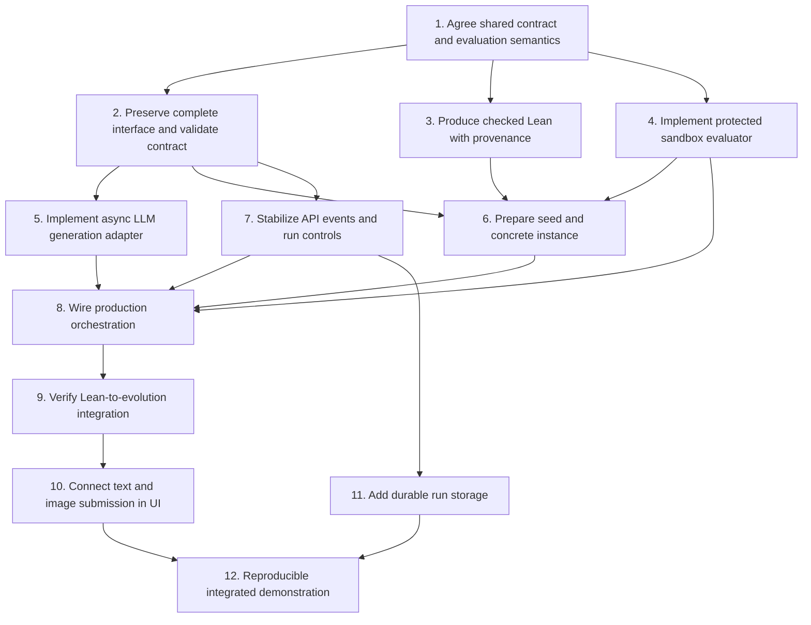

# Pipeline integration: next steps

Status: 2026-10-03, following the `eo_loop` merge into `feat/idea-tree`.

The Lean extractor, contract builder, and evolution loop have compatible interfaces, but the full path is not yet wired or verified end to end. The UI currently runs the real evolution engine with a prepared Pigou contract and explicit demo generation/evaluation adapters. It bypasses Lean extraction and contract construction.

See [current integration status](ui-integration-status.md) for what is connected and [evolution design](evolution.md) for the search policy. This checklist proposes integration work; it does not assign teammates or change the agreed architecture.

## Implementation dependency DAG

Arrows mean “must be ready before.” Independent branches can be implemented in parallel. This is a dependency graph, not the runtime feedback loop or idea lineage graph.

## TODO: unblock the core handoff

- [ ] **1. Agree the shared semantics before editing shared models.**
  - Confirm ownership of formalization, contract/extraction, generation, evaluation, and the API/UI boundary.
  - Decide how a contract bound to one instance relates to the declared metric aggregation “across instances.” Keep algorithms general; do not expose concrete benchmark answers in generation prompts.
  - Separate per-evaluation time/memory/iteration limits from whole-run time/token budgets. Define paused-time accounting, cancellation, and provider timeout behavior.
  - Define what “checked Lean” means and which check artifacts must accompany it. Lean specification checking does not prove generated Python correct.
  - **Done when:** these decisions are documented and producers/consumers use the same meanings.

- [ ] **2. Preserve the complete extracted interface in the contract.**
  - Carry the required supporting type definitions (currently `pydantic_classes_code`) or an equivalent versioned schema into generation prompts and the evaluation environment. The current builder discards them.
  - Validate seed signature compatibility during contract preparation, reusing the existing signature validator where appropriate.
  - Validate instance values/types as well as parameter names. Validate metric configuration and resource limits; prevent mutation of run-bound instance data after preparation.
  - Treat extracted helper code as generated code: parsing is not authorization to execute it in the API process.
  - **Done when:** a structured-input example reaches generation and evaluation without missing types, and malformed inputs fail before a run starts.

- [ ] **3. Connect Lean formalization and checking.**
  - Accept an existing Lean statement or obtain one from the natural-language specification; return checker diagnostics for correction.
  - Record source, Lean/toolchain and dependency versions, and check outcome. Do not infer verification from the extractor's Python syntax checks.
  - Move synchronous extraction off the async API event loop or provide an async adapter, with bounded calls and explicit errors.
  - **Done when:** checked input can advance to preparation and failed checks remain visible without starting evolution.

- [ ] **4. Implement the production `CandidateEvaluator` adapter.**
  - Run candidate code with the contract's instance and required interface definitions in an isolated execution environment.
  - Enforce resource limits and use a fixed, versioned deterministic judge for validity, primary metric, and tie-breakers. Generated code must not modify the judge or benchmark data.
  - Return one `CandidateEvaluation` per candidate, including failures, partial evidence, and behavioral descriptors where supported. Valid results must contain finite configured metrics.
  - If an LLM judge is included, keep its assessment separate from executable validity; it must not promote invalid candidates.
  - **Done when:** valid, invalid, crashing, and timed-out candidates produce consistent evidence and only valid results can become elites.

- [ ] **5. Implement the production `ProgramGenerator` adapter.**
  - Consume existing generation requests; return hypothesis and complete implementation together, following the current evolution design.
  - Preserve request IDs and return exactly one result or explicit failure per request, including measured token usage.
  - Bound concurrency, retries, provider calls, and cancellation. Preserve backend-selected ancestry and operators.
  - **Done when:** the existing loop can replace `DemoGenerator` without changing search policy.

- [ ] **6. Prepare a runnable problem contract.**
  - Supply or generate the seed, bind a concrete instance, carry the full interface, and select the agreed evaluator version.
  - Use `build_problem_contract` rather than a separately assembled production contract. Check/evaluate the seed and define the response to an invalid baseline.
  - Keep the prepared specification, instance, and evaluator fixed for the run.
  - **Done when:** preparation returns either an accepted contract with baseline evidence or actionable diagnostics.

## TODO: connect orchestration and UI

- [ ] **7. Stabilize events and controls with backend owners.**
  - Agree the versioned event envelope, snapshot format, ordered replay, terminal states, and reconnect behavior already prototyped by the bridge.
  - Decide whether to retain the separate observation subclass or provide native engine callbacks. Surface generation failures as well as evaluation failures.
  - Define pause-at-boundary, resume, stop, and cancellation behavior for real adapters.
  - Add explicit crossover-plus-mutation provenance if supported; the UI must not infer it from `crossover`. Keep inspiration references distinct from parent edges.
  - **Done when:** backend events fully drive the graph, research log, and controls without UI-side elite selection.

- [ ] **8. Wire the production orchestration entry point.**
  - Connect accepted Lean → extraction/preparation → `ProblemContract` → `EvolutionLoop.run(contract)` using production generator/evaluator adapters.
  - Expose preparation progress, diagnostics, and run identity through the API; handle failed stages without silently falling back to the demo.
  - Preserve a separately labeled demo mode for development without provider credentials.
  - **Done when:** one API flow reaches the real loop from checked Lean without manually constructing a contract.

- [ ] **9. Verify the complete handoff with focused integration checks.**
  - Exercise contract builder → loop together, including an example requiring supporting types and a nonempty instance. Existing component tests and the demo do not establish this path.
  - Cover signature mismatch, invalid instance, failed Lean checks, invalid/missing metrics, provider failure, timeout, and stop/reconnect behavior at their relevant boundaries.
  - Use deterministic provider doubles for repeatable checks, then run a small explicitly configured live-provider smoke test with a bounded budget.
  - **Done when:** evidence shows the same contract, instance, and evaluator version are used throughout, with failures retained and no invalid elite.

- [ ] **10. Connect the problem composer to preparation.**
  - Submit natural-language text, optional initial results, and supported image/document attachments to the backend preparation flow.
  - Implement attachment handling and OCR/vision interpretation; show extracted content and preparation diagnostics before research begins.
  - Replace the local-preview-only behavior once the production endpoint is ready. Preserve fades, grouped reveals, and automatic graph overview.
  - **Done when:** user input reaches the accepted contract and its run, with no silent substitution of the Pigou demo.

## TODO: make runs reproducible

- [ ] **11. Persist run state and evidence.**
  - Store prepared contracts, source artifacts, candidates, evaluations, event cursors, provider usage, and evaluator versions.
  - Define restart behavior explicitly: either recover work safely or mark interrupted runs, while retaining their history.
  - **Done when:** restarting the API does not lose completed evidence and reconnect uses persisted history. Add authentication before any non-local deployment.

- [ ] **12. Record one reproducible integrated demonstration.**
  - Run an agreed problem through preparation, generation, evaluation, archive selection, and the UI. Include rejected candidates and multi-parent ancestry when produced.
  - Record commands, tool/model versions, input and evaluator versions, actual costs, and results. Distinguish rediscovering a known bound from a new result.
  - Resolve the team's Python-version/lockfile policy and document a reproducible installation. Preserve the currently uncommitted `uv.lock` edit until reconciled deliberately.
  - **Done when:** another teammate can reproduce the run and inspect the evidence from the documented setup.
