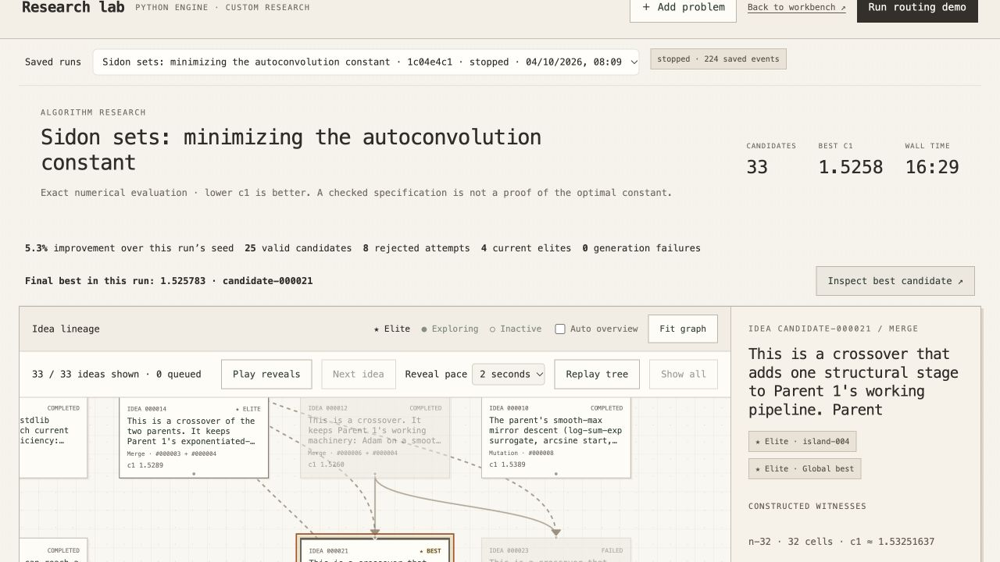

# Sidon benchmark: literature-guided reasoning run

4 October 2026. The same 32/64/128-cell benchmark improved from **1.611191 to 1.525783** (5.3%). Candidate `candidate-000021` is highlighted as **BEST** in the saved DAG. This is an improvement of our pipeline's numerical benchmark, not a solution of the open problem or a new state-of-the-art bound.

[Open the local run](http://127.0.0.1:5173/engine.html?run=1c04e4c1-21aa-48f7-8562-0c298c60595c).

| Evaluation | Result |
| --- | ---: |
| 32 cells | 1.532516373230519 |
| 64 cells | 1.524128170799656 |
| 128 cells | 1.5207036682764783 |
| Benchmark mean | **1.525782737435551** |
| Held-out mean, 48/96/256 cells | **1.522288182078080** |

All three held-out cases passed in Docker. Held-out results were not fed into evolution. The benchmark mean is an algorithm score across resolutions; individual exact witnesses supply upper bounds. None beat the supplied published reference of approximately 1.5029.

The run produced 33 candidates (25 valid, eight rejected), four generations and 224 persisted events in about 16 minutes 30 seconds. All 89 saved benchmark case witnesses were independently recalculated with exact rational arithmetic. The winner combines coarse-to-fine optimization and restarts with a sharper final smoothing schedule. The run received an external UI/API Stop command at 08:25 London time; its status remains **stopped**, and no paid restart was made.

## Changes and cost

Merged `origin/main` into `feat/research-cleanup`, preserving the registered fitness evaluator and parallel evaluation. Changes were focused on integration and defects, without broad refactoring of teammates' code. The UI now identifies and selects the final winner, preserves parent-first DAG arrival order, and offers paced reveal controls (default two seconds per card).

Generation used Claude Opus 5.5 with high adaptive reasoning. Sonnet 4.6 handled the opening literature search and advisory critic. The review made three web searches and collected 22 source URLs; prompts retain independent restarts and competing approaches. A truncated initial review was retained as a failed run, then fixed with bounded synthesis. Literature guidance is source material, not a guarantee that every cited claim is correct or that the search is exhaustive.

The custom budget defaults to **US$50**. This run received $49.73 after the initial failed review cost $0.260514. Combined recorded API usage is **$6.440084**, or **$6.981048** including conservative reservations for two interrupted calls. These are estimates from reported usage and configured prices, not an invoice; hosting, tax and preparation outside the research run are excluded. The successful review/evolution run reported 620,000 total provider tokens, including literature and critic calls. Reservations are shared across concurrent requests and retained when billing is uncertain.

Because model, literature context and search budget changed together, this is not a controlled attribution of the improvement to any one feature. The same evaluation suite, resource limits, seed, objective and checked Lean specification were retained. The existing formalization still required a manually reviewed repair and an acknowledged alignment review; this was not a fully automatic formalization success.

## Verification and replay

143 backend tests and 11 frontend tests passed; the frontend production build passed. Browser inspection verified saved history, the gold BEST card, exact witness display, budget controls and literature provenance. Restarting the backend restored the stopped run and its winning summary.

[Evidence bundle](../output/demo-verification/sidon-reasoning-evidence.zip) includes candidate code, exact witnesses, held-out evaluation, every DAG event, lineage CSV, review sources, budget records and test logs. Run `scripts/start_lab.sh` from this checkout when the local services are not already running. Import the bundled run with `scripts/import_run.py` if moving the demo to another machine.

