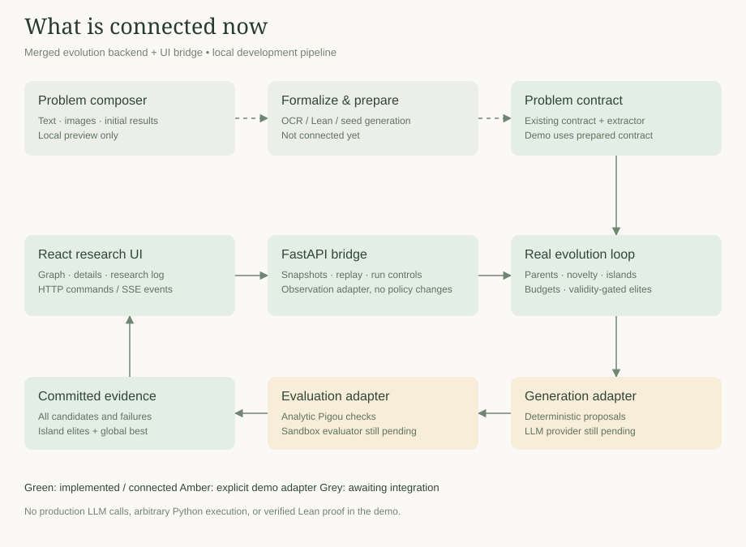

# UI integration status

The UI bridge uses the shared evolution engine and prepared contract. The
contract now binds a complete versioned interface and immutable evaluation
suite; production preparation and sandbox adapters are still outstanding.



## Connected now

- React → Vite `/api` proxy → FastAPI on port 8000.
- HTTP run creation, snapshots, pause/resume/stop, and ordered SSE with replay using `Last-Event-ID`.
- Real `EvolutionLoop` and `EvolutionEngine`: generation planning, parent selection, novelty, islands, elite preservation, static rejection, and budget accounting.
- Native `EvolutionObserver` callbacks publish candidates, evaluation lifecycle,
  generation failures, and committed state without replacing or subclassing the
  engine. The versioned snapshot/event and control semantics are specified in
  [the API/event contract](api-events.md).
- Candidate hypotheses become titles/descriptions; source, predictions, falsification conditions, islands, and inspirations are visible in the inspector. Inspirations are separate clickable references, not parent edges.
- Actual backend generation numbers and primary metric direction are used. `crossover` maps to merge, `repair` remains repair. A merged mutation is not inferred: the backend currently has no explicit field for it.
- Current/former island elites and global best come from the engine. No UI-side ranking determines elite membership.
- Pausing drains the current batch and gates the loop at its native next-batch
  checkpoint, independent of generator implementation. Stop cancels the local
  task. Snapshot/event history is in server memory; the browser remembers its
  run ID in session storage and can reconnect after refresh.

## Explicit placeholders

`ui/demo.py` supplies a prepared Pigou contract, deterministic proposals, and an analytic evaluator. The evaluator reads a restricted constant-return AST and never executes generated Python. No LLM call, sandbox, image interpretation, or Lean proof check happens in this demonstration. Token counts are simulated adapter usage. Search policy and archive decisions are real.

The main AntiAI composer calls the hosted formalization pipeline described below. Custom problems are not routed into the prepared evolution demo. The evolution API accepts only explicit demo runs; `/api/formalizations` handles custom Lean preparation. The development API binds to localhost and has no deployment authentication or durable storage; it is not a public hosting configuration.

## Remaining work / decisions

1. The production Anthropic generator is implemented; the protected sandboxed
   evaluator remains outstanding.
2. Natural-language/image input → formalization → checked Lean → contract and seed preparation. The contract now carries the complete interface; production sandbox loading remains outstanding.
3. Production orchestration must instantiate the documented version-one wire
   boundary after contract preparation; the local API still starts only demo runs.
4. Live token events are not emitted mid-call. Final provider usage and failures
   are retained after each bounded generation request.
5. Explicit short titles and crossover-plus-mutation provenance if required. Do not fabricate these fields from an operator label.
6. Persistent run storage and authenticated deployment.
7. Evolution time limits are checked between operations, not enforced as hard interruption of a stalled provider/evaluator. The development bridge excludes fully paused time through its active-time clock; production orchestration must preserve that semantic.
8. `uv.lock` was already locally modified (Python 3.12 resolution). It is tracked despite `.gitignore`. That modification was preserved and excluded from integration commits; the team should agree its Python version/lock policy. Optional UI dependencies were installed directly into the existing virtual environment without rewriting the lock.

## Run locally

Install existing project dependencies as usual, then install the additive API dependencies:

```sh
uv pip install --python .venv/bin/python 'fastapi>=0.115' 'uvicorn>=0.30'
```

Terminal 1, repository root:

```sh
PYTHONPATH=src .venv/bin/python -m uvicorn the_pigeon_holes.ui.api:app --host 127.0.0.1 --port 8000
```

Terminal 2:

```sh
cd frontend
npm ci
npm run dev
```

Open http://127.0.0.1:5173 and run the routing demo. `GET /api/health` identifies the real engine and demo adapters. At most one run is active and 20 runs are retained in this development server; restarting clears history.

Validation: Python suite plus bridge tests (`.venv/bin/python -m pytest -q`), frontend tests (`npm --prefix frontend test`), production build (`npm --prefix frontend run build`), and browser/HTTP integration checks. These do not establish scientific novelty or production adapter correctness.

## Hosted formalization (AntiAI integration)

The composer now calls `POST /api/formalizations`. Natural-language input uses
Qwen3-4B-Instruct-2507, then pinned Lean 4.19/Mathlib checking in a Modal worker,
with continued repair on checker failure until Lean passes or the user stops. Existing Lean input is checked first and repaired if needed.
Successful checks are scored by the frozen fine-tuned fidelity classifier. A review
result is displayed explicitly; it is not treated as accepted. The generator uses
the pretrained instruction model, because the frozen fine-tuned checkpoint is a
sequence classifier and cannot generate Lean. Initial generation is greedy; repair candidates use seeded sampling to escape repeated failures.
Only the Lean check is the deterministic validation step.

Deploy both services in the workspace that owns the classifier:

```sh
.venv/bin/modal deploy --profile arin06 research/lean-fidelity/modal_generation.py
.venv/bin/modal deploy --profile arin06 research/lean-fidelity/modal_checker.py
MODAL_PROFILE=arin06 .venv/bin/python -m uvicorn the_pigeon_holes.ui.api:app --host 127.0.0.1 --port 8000
```

The main `frontend/index.html` preserves the AntiAI paper workbench design.
The engine demonstration remains at `/engine.html`. Set `RESEARCH_API_URL` when
starting Vite if the Python API uses a port other than 8000.
For a classifier in a separate workspace, set `FIDELITY_ENDPOINT`,
`FIDELITY_TOKEN_ID`, and `FIDELITY_TOKEN_SECRET` on the backend; otherwise the
Modal SDK uses the selected profile for all three services.
The existing `lean-fidelity-api` deployment supplies fidelity scoring. The Python
backend uses authenticated Modal SDK calls with the operator's Modal credentials;
no credentials are sent to the browser. Install UI dependencies with
`uv pip install --python .venv/bin/python -e '.[ui]'`. Keep the API bound to localhost.
The Lean admission filter is conservative; this is not a public arbitrary-code service.

The original standalone demo is accessible using **Open demo page** in the header
(`/api/demo`), and **Run routing demo** retains the engine-backed demo.
Custom formalizations are returned for review; building custom evaluation suites,
seed programs, and contracts for autonomous evolution remains separate work.

## Attachments and shared AntiAI theme

Both natural-language and existing-Lean modes accept photos and attachments.
PNG/JPEG/WebP, PDF (up to 10 pages), UTF-8 text/Markdown, JSON/CSV, and Lean
files are supported, up to 10 MB each. `POST /api/attachments?filename=...`
accepts raw file bytes and returns extracted text. Text files are decoded in the
backend; images and scanned PDF pages use the CPU-only `lean-attachments` Modal
service in `arin06`. Deploy using:

```sh
.venv/bin/modal deploy --profile arin06 research/lean-fidelity/modal_attachments.py
```

Extraction populates editable fields before submission. Users must review OCR,
especially handwriting and mathematical symbols. In formal mode, attachment text
can populate either the problem description or Lean source. No attachment is
silently passed to the text-only generation model.

The workbench, live engine demo (`/engine.html`), and retained scripted demo
(`/api/demo`) share `frontend/src/paper-theme.css`: monospace typography, paper
backgrounds, square controls, and restrained orange selection accents. The main
**Open demo page** link opens the themed engine demo.

Validation: 63 Python tests, three frontend tests, production build, live hosted
PNG and scanned-PDF OCR, and a browser check of the running engine demo.


## Repair until checked

Both composer interfaces stream attempts from `POST /api/formalizations?stream=true`.
Failed checks feed the original problem, current code, and diagnostics into Qwen
again until a check passes. Existing Lean is checked first, then repaired while
instructing the model to preserve its original statement. There is no global
attempt or 15-minute cutoff. Individual model/checker calls retain timeouts.
The Stop control aborts the stream; the backend cancels the active Modal call and
releases the single-run lock. Disconnecting also stops the task. Every attempt
streams source and diagnostics before another repair. Service errors stop with
an error, and a passed check proceeds to fidelity scoring; fidelity review is
not treated as a compilation failure.

Repair prompts include explicit Lean 4 syntax guidance. Every third repair asks
for a fresh minimal proof instead of reusing failed intermediate steps. This is
a search policy, not a guarantee that an arbitrary statement can be proved.

Repair sampling uses temperature 0.7 and top-p 0.9 with an attempt-specific seed.
The pretrained fidelity benchmark judge remains greedy and unchanged.
A compiler-confirmed `refine` inference-hole error also triggers a narrow syntax
repair (`refine ⟨…, _⟩` → `refine ⟨…, ?_⟩`) before another model call. The repaired
source must still pass the same Lean checker.
